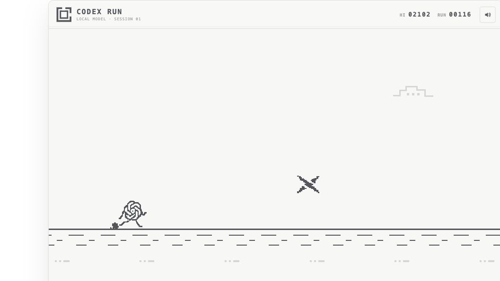

# Codex Run

Codex Run is a small endless runner built as a local Codex/ChatGPT plugin with an MCP App UI. Its monochrome pixel language nods to Chrome's offline dinosaur game, with an animated Codex knot racing past Claude, Gemini, Grok, Kimi, and broken developer tools.

The game loop, rendering, input, sound, scoring, and high-score persistence all run in the embedded client. Starting the game uses one fast MCP tool; normal play makes no tool or model calls.



## Play

- Press **Space**, **W**, or **Up Arrow**, or tap/click the game, to jump.
- Use the same input after a collision for an immediate restart.
- Claude, Gemini, Kimi, and developer hazards must be jumped. Stay low beneath airborne Grok marks.
- Use the speaker control to mute generated sound cues.
- Use the pop-out control when the host confirms picture-in-picture. If the Codex build rejects the request, the game stays inline and explains why.

## Automatic launch during complex work

Codex Run includes a plugin-bundled `UserPromptSubmit` hook. It injects the auto-start setting on every turn, including unrelated prompts, and asks Codex to judge whether the work is complex, multi-stage, research-heavy, verification-heavy, or long-running. Qualifying turns open the game once near the start while Codex continues working.

Auto-start is enabled by default. Ask **“Disable Codex Run auto-start”** or **“Enable Codex Run auto-start”** to persistently change it. Explicit **“Start Codex Run”** requests always work. Codex requires a one-time review and trust approval before a newly installed plugin command hook can run.

## Install from GitHub

Requires Codex desktop and Node.js 20 or newer.

```bash
codex plugin marketplace add MAK-Michael/codex-run-game-plugin --ref main
```

Restart Codex so it refreshes the marketplace, then open the Plugins Directory, choose **Codex Run**, and install/enable the plugin. Review and trust the bundled command hook when Codex prompts you. Start a new task and ask **“Start Codex Run.”**

The repository includes compiled plugin output, so a marketplace installation does not need `npm install` or a local build.

## Build and verify from source

Requires Node.js 20 or newer.

```bash
cd plugins/sunskip
npm install
npm run verify
```

`verify` runs strict TypeScript checking, the focused regression suite, and the production Vite/esbuild build. The output is self-contained under `plugins/sunskip/dist/`; the stdio MCP server bundles its dependencies and serves the single-file UI from `dist/ui/index.html`.

For local UI development:

```bash
cd plugins/sunskip
npm run dev
```

## Install from a local checkout

This repository includes a repo marketplace at `.agents/plugins/marketplace.json` and the installable plugin at `plugins/sunskip`.

1. Build the plugin with `npm run build` from `plugins/sunskip` if you changed the source.
2. Open this repository as a Codex project and restart the desktop app so it refreshes the repo marketplace.
3. Open the Plugins Directory, find **Codex Run**, and install/enable it.
4. Review and trust the Codex Run hook when Codex prompts you, then start a new task. Ask **“Start Codex Run”** for an explicit launch or give Codex a substantial task to exercise auto-start.

The plugin launches `node ./dist/server/index.js` from its installed root. No API key, login, backend, or network access is required.

## Privacy

Codex Run is local-only. It does not make network requests, collect analytics, require an account, or spend model tokens during gameplay. The only persistent data is the high score, sound setting, and auto-start preference stored on the local machine.

## License and trademarks

The source code is available under the [MIT License](./LICENSE). Codex Run is an independent project and is not affiliated with or endorsed by OpenAI or the other companies referenced in the game. Product names and trademarks belong to their respective owners.

## Architecture

```text
plugins/sunskip/
├── .codex-plugin/plugin.json   # install and presentation metadata
├── .mcp.json                   # bundled stdio MCP server
├── hooks/                      # every-turn auto-start preference injection
├── skills/                     # optional auto-start preference workflow
├── src/game/core.ts            # deterministic game state and collisions
├── src/ui/                     # Canvas renderer, controls, audio, MCP Apps bridge
├── src/server/                 # one start tool and one UI resource
└── dist/                       # production server and single-file UI
```

The MCP tool `start_codex_run` returns immediately with `status: "ready"` and links to `ui://codex-run/game-v1.html` using the standard `_meta.ui.resourceUri`. The UI resource uses `text/html;profile=mcp-app`, initializes the MCP Apps bridge, and feature-detects the optional `window.openai.requestDisplayMode` extension. A PiP request is treated as successful only after the host reports the new display mode; rejected or no-op requests leave the game inline with visible feedback.

The high score and sound preference are stored by the embedded UI. The auto-start preference is stored locally under the user's Codex home. There is no account or server-side state.

## Focused tests

The suite intentionally contains focused regression tests for:

1. **One jump before landing** catches accidental mid-air double jumps.
2. **Frame-rate-independent acceleration/scoring** catches score or speed drift across update rates.
3. **Collision versus a cleared obstacle** catches broken hitboxes and missing game-over transitions.
4. **Clean restart** catches obstacle, score, or state leakage into the next run.
5. **MCP launch contract** catches drift between the advertised start tool, UI resource URI, MCP App MIME type, and structured result.
6. **Sprite atlas contract** keeps the exact three-color palette and requires every player frame to use the same Codex knot body pixels.
7. **Host display-mode confirmation** prevents a resolved-but-ignored PiP request from being reported as successful.
8. **Persistent auto-start preference** keeps the plugin hook and MCP settings tool aligned.

There are no snapshots, trivial component tests, coverage targets, or framework-behavior tests.
